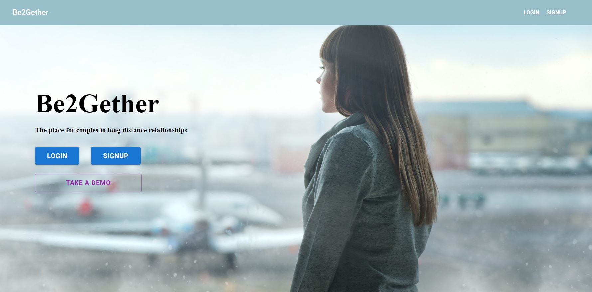

# Be2Gether-MERNG

[Link](https://be2gether.netlify.app/) to the live project

## Table of contents
* [General Info](#general-info)
* [Technologies](#technologies)
* [Backend](#backend)
* [Setup](#setup)

## General Info

Be2Gether is a social media app for couples in long distance relationships. User can login into their profile and connect to their partner. The app includes a chat and^a world map where they can mark for example places they visited together and share their memories in text in images. This repo contains the frontend of Be2Gether.

### Screenshot




## Technologies

This project is created with:
* @apollo/client version: 3.3.21,
* @emotion/react version: 11.8.2,
* @emotion/styled version: 11.8.1,
* @mui/icons-material version: 5.5.0,
* @mui/material version: 5.5.0,
* @mui/styles version: 5.5.0,
* firebase version: 9.8.1,
* graphql version: 15.5.1,
* jwt-decode version: 3.1.2,
* leaflet version: 1.7.1,
* leaflet-control-geocoder version: 2.3.0,
* moment version: 2.29.1,
* react version: 17.0.2,
* react-dom version: 17.0.2,
* react-file-base64 version: 1.0.3,
* react-leaflet version: 3.2.1,
* react-leaflet-search version: 2.0.1,
* react-router-dom version: 5.2.0,
* react-scripts version: 4.0.3,
* subscriptions-transport-ws version: 0.9.19


## Backend

Here is the link to the [backend repo](https://github.com/Frisianrage/Be2Gether-MERNG-backend).


## Setup

### Clone the repository from GitHub.

```
$ git clone https://github.com/Frisianrage/Be2Gether-MERNG-frontend.git
```

### Install Dependencies and Run the Server

```
$ npm install
$ npm start
```
